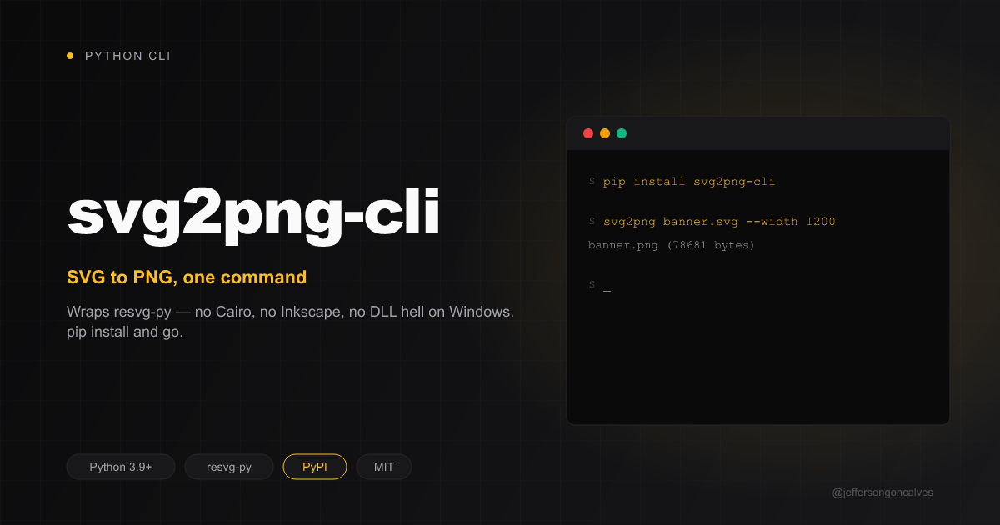

# svg2png-cli

[](https://buymeacoffee.com/jeffersongoncalves)



[](https://pypi.org/project/svg2png-cli/)
[](https://pypi.org/project/svg2png-cli/)
[](LICENSE)

Tiny CLI to convert SVG to PNG. Wraps [resvg-py](https://pypi.org/project/resvg-py/) (pure Rust, no native Cairo/Inkscape dependency — the reason `cairosvg` fails out of the box on Windows).

## Why

- **No system dependencies.** `cairosvg` needs Cairo installed natively — a pain on Windows. `resvg-py` ships a compiled Rust binary via pip, so `pip install` is the whole setup.
- **One command.** No Python API to learn, no boilerplate script — just `svg2png in.svg`.
- **Fast.** [resvg](https://github.com/RazrFalcon/resvg) is a small, fast, correct SVG renderer.

## Install

```bash
pip install svg2png-cli
```

Or straight from GitHub / editable mode:

```bash
pip install git+https://github.com/jeffersongoncalves/svg2png-cli.git
```

Requires Python 3.10+.

## Usage

```bash
svg2png banner.svg                     # writes banner.png next to it
svg2png banner.svg out.png             # explicit output path
svg2png banner.svg out.png --width 1200 --height 630
```

| Argument | Required | Description |
|---|---|---|
| `svg` | yes | Path to the source `.svg` file |
| `png` | no | Output `.png` path (default: same name as SVG, `.png` extension) |
| `--width` | no | Output width in px (default: SVG's own size) |
| `--height` | no | Output height in px (default: SVG's own size) |

On success, prints the output path and file size:

```
banner.png (48213 bytes)
```

Exits non-zero with an error message if the input file doesn't exist.

## License

MIT © [Jefferson Gonçalves](https://github.com/jeffersongoncalves)
